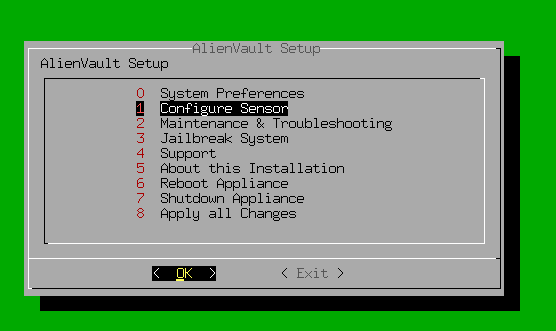

# AlienVault OSSIM Implementation

A comprehensive guide to deploying an open-source SIEM solution with distributed architecture

<p align="center">
  
</p>

## 📋 Table of Contents
- [Overview](#overview)
- [Architecture](#architecture)
- [Installation Guide](#installation-guide)
  - [Network Setup](#network-setup)
  - [OSSIM Server Deployment](#ossim-server-deployment)
  - [OSSIM Sensor Deployment](#ossim-sensor-deployment)
  - [Target Systems Setup](#target-systems-setup)
- [Configuration](#configuration)
  - [Server Configuration](#server-configuration)
  - [Sensor Configuration](#sensor-configuration)
  - [Log Forwarding Setup](#log-forwarding-setup)
  - [Detection Rules](#detection-rules)
- [Use Cases](#use-cases)
- [Resources](#resources)

## 🔍 Overview

This project documents the implementation of AlienVault OSSIM (Open Source Security Information and Event Management), a comprehensive SIEM solution for threat detection, incident response, and compliance management. The implementation follows a distributed architecture with separate server and sensor components to demonstrate enterprise-grade deployment scenarios.

## 🏗️ Architecture


**How It Works**
- **Sensor**: Watches traffic, detects attacks (e.g., scans from Kali), sends alerts to Server.
- **Server**: Analyzes alerts and logs to identify threats.
- **Web Server**: Sends logs (e.g., SSH, HTTP) to Server; monitored by Sensor.
- **Kali**: Tests the system with attacks.

**Key Features**
- **Monitoring**: Sensor flags suspicious traffic.
- **Logs**: Web Server forwards logs to Server.
- **Visibility**: Server combines data for threat detection.

**Software Requirements**:
- VirtualBox (latest version)
- AlienVault OSSIM ISO 
  - Official Download: [AT&T Cybersecurity](https://cybersecurity.att.com/products/ossim/download)  
  > ⚠️ Note: Versions 5.8.14 and later of the official ISO are known to hang or fail during the `alienvault-gvm11-feed` step, leading to incomplete installs and missing configuration files :contentReference[oaicite:0]{index=0}.  
  - **Use this stably tested in our lab ISO** : [Download alienvault-ossim-custom.iso](https://github.com/aymenmarjan/Implementing-AlienVault-OSSIM-with-Distributed-Architecture/releases/download/v1.0/alienvault-ossim-custom.iso)
- Ubuntu Server ISO ([Download Link](https://ubuntu.com/download/server))
- Kali Linux VirtualBox VM ([Download Link](https://www.kali.org/get-kali/#kali-virtual-machines))

## 🚀 Installation Guide

### Network Setup

The lab environment uses a host-only network (`192.168.100.0/24`) for isolation and security.

| VM | IP Address | Function |
|----|------------|----------|
| OSSIM Server | 192.168.100.150 | Central management |
| OSSIM Sensor | 192.168.100.151 | Distributed monitoring |
| Ubuntu Web Server | 192.168.100.200 | Target system |
| Kali Linux | 192.168.100.102 | Attack simulation |

#### Steps to create Host-Only Network in VirtualBox:

1. Open VirtualBox
2. Navigate to File → Host Network Manager
3. Create a new network with the following settings:
   - IPv4 Address: 192.168.100.1
   - Network Mask: 255.255.255.0

<p align="center">
  
</p>

   - Don't forget to configure DHCP Server

<p align="center">
  
</p>

### OSSIM Server Deployment

Detailed steps to install and configure the OSSIM server VM:

1. **Create the VM**:
   - Name: ossim-server
   - OS: Debian (64-bit)
   - Memory: 4GB+ RAM
   - CPU: 2-3 processors
   - Storage: 25GB
   
   > 💡 **Tip**: Skip adding the ISO when creating the VM. We'll mount it manually later.

2. **Installation Process**:

   Power on, Then follow:

   <div align="center">
   
   | Step | Screenshot |
   |------|------------|
   | **Boot from ISO Image** |  |
   | **Select Server Deployment Mode** |  |
   | **Configure System Language** |  |
   | **Set Geographic Location** |  |
   | **Configure Keyboard Layout** |  |
   | **Configure Network: IP Address** (Use `192.168.100.150`) |  |
   | **Configure Network: Subnet Mask** (Leave default) |  |
   | **Configure Network: Gateway** (Use `192.168.100.1`) |  |
   | **Configure Network: DNS Server** (Use `192.168.100.1`) |  |
   | **Set Root Password** |  |
   | **Select Time Zone** |  |
   | **Wait..** |  |
   | **Wait more...** |  |
   | **Installation Complete** |  |
   
   </div>

3. **Post-Installation Configuration**:

   <div align="center">
   
   | Step | Screenshot |
   |------|------------|
   | **Login and Shutdown** (as we set before: `root:root`) |  |
   | **Configure VM Network Adapter** (Change to `Host-Only Adapter`) |  |
   
   </div>

### OSSIM Sensor Deployment

Steps to install and configure the OSSIM sensor VM:

1. **Create the VM**:
   - Name: ossim-sensor
   - OS: Debian (64-bit)
   - Memory: 4GB+ RAM
   - CPU: 2 processors
   - Storage: 15GB
   
   > 💡 **Tip**: Skip adding the ISO when creating the VM. We'll mount it manually later.

2. **Installation Process**:

   Power on, Then follow:

   <div align="center">
   
   | Step | Screenshot |
   |------|------------|
   | **Boot from ISO Image** |  |
   | **Select Sensor Installation Mode** |  |
   | **Configure System Language** |  |
   | **Set Geographic Location** |  |
   | **Configure Keyboard Layout** |  |
   | **Configure Network: IP Address** (Use `192.168.100.151`) |  |
   | **Configure Network: Subnet Mask** (Leave default) |  |
   | **Configure Network: Gateway** (Use `192.168.100.1`) |  |
   | **Configure Network: DNS Server** (Use `192.168.100.1`) |  |
   | **Set Root Password** |  |
   | **Select Time Zone** |  |
   | **Wait..** |  |
   | **Wait more...** |  |
   | **Installation Complete** |  |
   
   </div>

4. **Network Interface Configuration**:

   After you shut it down, you should configure 2 interfaces as:

   <div align="center">
   
   | Configuration | Screenshot |
   |---------------|------------|
   | **NIC1: Host-only Adapter** |  |
   | **NIC2: Host-only Adapter with Promiscuous Mode set to "Allow All"** |  |
   
   </div>

### Additional Server And Sensor Configuration

Run both machines together.

<p align="center">
  
</p>

1. **Server-Sensor Connectivity Test**:
   
   From The `Ossim-Server` machine (or the opposite):

   <div align="center">
   
   | Step | Screenshot |
   |------|------------|
   | **Access System Shell** (Select "Jailbreak System") |  |
   | **Confirm Shell Access** |  |
   | **Test Network Connectivity** (Ping on Sensor) |  |
   
   </div>

2. **Server Configuration**:

   <div align="center">
   
   | Step | Screenshot |
   |------|------------|
   | **Boot Server VM** |  |
   | **Access Hostname Configuration** |  |
   | **Set System Hostname** (Use `Ossimserver`) |  |
   | **Confirm Hostname Change** |  |
   | **Return to Main Menu** |  |
   | **Access Sensor Configuration** |  |
   | **Configure Data Sources** |  |
   | **Enable Syslog Collection** |  |
   | **Return to Main Menu** |  |
   | **Apply Configuration Changes** |  |
   | **Confirm Configuration Update** |  |
   | **Wait for Configuration Process** |  |
   | **Complete Configuration** |  |
   
   </div>

3. **Sensor Configuration**:

   <div align="center">
   
   | Step | Screenshot |
   |------|------------|
   | **Boot Sensor VM** |  |
   | **Access Hostname Configuration** |  |
   | **Set the Hostname as `OssimSensor`** |  |
   | **Confirm Hostname Change** |  |
   | **Access Sensor Configuration Menu** |  |
   | **Configure Data Source Plugins** |  |
   | **Enable Syslog Collection** |  |
   | **Configure AlienVault Server IP** |  |
   | **Set Server IP Address** (Enter `192.168.100.150`) |  |
   | **Configure AlienVault Framework IP** |  |
   | **Set Framework IP Address** (Enter `192.168.100.150`) |  |
   | **Configure Network Monitoring** |  |
   | **Select Monitoring Interface** (Choose `eth1` with Promiscuous Mode) |  |
   | **Return to Main Menu** |  |
   | **Apply Configuration Changes** |  |
   | **Confirm Configuration Update** |  |
   | **Wait for Configuration Process** |  |
   
   </div>

### Target Systems Setup

#### Ubuntu Web Server

1. **Create the VM**:
   - Name: web-server
   - OS: Ubuntu Server (64-bit)
   - Memory: 4GB RAM
   - CPU: 2 processors
   - Storage: 15GB fixed disk

2. **Installation Process**:
> Follow default steps

   <div align="center">
   
   | Step | Screenshot |
   |------|------------|
   | **Configure User Profile and Credentials** |  |
   | **Installation Complete and System Ready** |  |
   
   </div>

4. **Install and Configure Apache**:

   ```bash
   sudo apt update
   sudo apt install apache2
   sudo ufw allow 'Apache'
   sudo ufw allow 'OpenSSH'
   sudo ufw enable
   ```

5. **Change network mode to Host-Only Adapter**:
   
   From now on, we won't need the Internet on this virtual machine. Power it off and change its networking mode to Host-Only Adapter.

6. **Configure Static IP**:

   ```bash
   # Edit Netplan configuration
   sudo nano /etc/netplan/00-installer-config.yaml
   ```
   
   Example configuration:
   
   ```yaml
   network:
     ethernets:
       enp0s3:
         addresses: [192.168.100.200/24]
         gateway4: 192.168.100.1
     version: 2
   ```

#### Kali Linux VM

1. **Import Pre-built Image**:
   - Add the Kali .vbox file to VirtualBox
   - Rename to "Kali-2023-VM"

2. **Update the System**:

   ```bash
   sudo apt update
   sudo apt upgrade -y
   ```

3. **Network Configuration**:
   
   After you updated the system, You can change network mode to Host-Only Adapter.

## ⚙️ Configuration

Turn on all the VMs

<p align="center">
  
</p>

### Server Configuration

1. **Access the Web Interface**:
   - Navigate to https://192.168.100.150
   - Create admin account

   <p align="center">
     
   </p>

2. **Environment Setup via Wizard**:
   - Add hosts:
     - OSSIM server
     - Sensor
     - Kali machine
     - Web server
   - Assign correct OS type
   - Deploy HIDS agents
  
3. **Steps**:

   <div align="center">
   
   | Step | Screenshot |
   |------|------------|
   | **Start Configuration Wizard** |  |
   | **Proceed to Next Step** |  |
   | **Add the missing machines, Select every machine's OS** |  |
   | **OSSIM Server & Sensor Credentials** (`root:root`) |  |
   | **Web Server Credentials** (`marjan:123`) |  |
   | **Skip LOG MANAGEMENT** (Internet access required) |  |
   | **Skip JOIN OTX** (Internet access required) |  |
   | **Complete the Configuration Wizard** |  |
   | **Launch OSSIM Dashboard** |  |
   | **OSSIM Web Interface Ready for Use** |  |
   
   </div>

### Sensor Configuration

1. **Verify Sensor Connection**:
   
   - On server, click `Insert` under **Configuration** → **Deployment** → **Components** → **SENSORS**

   <p align="center">
     
   </p>

   - Configure the sensor (192.168.100.151) to be added.

   <p align="center">
     
   </p>

   <p align="center">
     
   </p>

2. **Configure Detection Settings**:

   <div align="center">
   
   | Step | Screenshot |
   |------|------------|
   | **Click on `system detail` icon** |  |
   | **Click `Sensor Configuration`** |  |
   | **Click `Detection`** |  |
   | **Verify Detection Settings** (Make sure you have the same) |  |
   
   </div>

3. **Detection Test**:

   <div align="center">
   
   | Step | Screenshot |
   |------|------------|
   | Search `nikto` under **Configuration** → **THREAT INTELLIGENCE** → **DIRECTIVES** |  |
   | **Clone Directive** |  |
   | **Click on `+` button beside `!HOME_NET` (`FROM` column)** |  |
   | **In source section replace `!HOME_NET` with `HOME_NET`, Then click `MODIFY`** |  |
   | **Reload Directive to save** |  |
   
   </div>

**On OssimSensor terminal (`Jailbreak System` option)**

 ```bash
  nano /etc/suricata/suricata.yaml
 ```
**Set `EXTERNAL_NET: any`, Save and exit.**

   <p align="center">
     
   </p>

**Restart suricata service, Exit terminal.**

 ```bash
  service suricata restart
 ```

**On Kali VM**

  ```bash
   sudo nikto -h 192.168.100.200
  ```

**And There we have it! We found our sercurity events under **ANALYSIS** → **ALARMS****

   <p align="center">
     
   </p>

### Log Forwarding Setup

1. **Configure Syslog on Web Server**:

   ```bash
   # Edit rsyslog configuration
   sudo nano /etc/rsyslog.d/50-default.conf
   ```

   Add the following line:
   
   ```
   *.* @192.168.100.150:514
   ```

2. **Restart Service**:

   ```bash
   sudo systemctl restart rsyslog
   ```

3. **Verify Log Forwarding**:

   **On the server**:
   
   ```bash
   sudo tcpdump -i eth0 port 514
   ```
   
   <div align="center">
   
   | Step | Screenshot |
   |------|------------|
   | **SSH connection attempt from Kali VM** |  |
   | **Logs received via syslog** |  |
   | **Logs recieved Also on our SIEM interface (Under `ANALYSIS` → `SECURITY EVENTS (SIEM)`)** |  |
   
   </div>

## 📊 Use Cases
OSSIM supports multiple security monitoring use cases:

- **Real-time Monitoring:** Tracks network and system events, provides alerts for suspicious activity, and helps manage incident response.
- **Compliance Management:** Creates compliance reports, maintains audit logs, and documents security control performance.
- **Threat Intelligence Integration:** Uses OTX feeds to correlate events with global threats and detect new vulnerabilities.

## 📚 Resources

- [Official AlienVault Documentation](https://cybersecurity.att.com/documentation)
- [Youtube Playlist Comprehensive Tutorial](https://www.youtube.com/playlist?list=PLxTwjzMO9Zf5VdowToEnM_DdHDgAVtCem)
