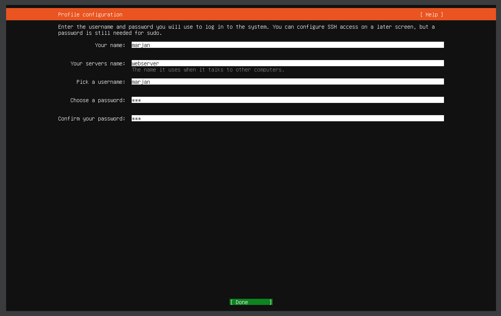

# AlienVault OSSIM Implementation
*A comprehensive guide to deploying an open-source SIEM solution with distributed architecture*

## 📋 Table of Contents
- [Overview](#overview)
- [Architecture](#architecture)
- [Installation Guide](#installation-guide)
  - [Network Setup](#network-setup)
  - [OSSIM Server Deployment](#ossim-server-deployment)
  - [OSSIM Sensor Deployment](#ossim-sensor-deployment)
  - [Target Systems Setup](#target-systems-setup)
- [Configuration](#configuration)
  - [Server Configuration](#server-configuration)
  - [Sensor Configuration](#sensor-configuration)
  - [Log Forwarding Setup](#log-forwarding-setup)
  - [Detection Rules](#detection-rules)
- [Testing & Validation](#testing--validation)
- [Use Cases](#use-cases)
- [Resources](#resources)

## 🔍 Overview
This project documents the implementation of AlienVault OSSIM (Open Source Security Information and Event Management), a comprehensive SIEM solution for threat detection, incident response, and compliance management. The implementation follows a distributed architecture with separate server and sensor components to demonstrate enterprise-grade deployment scenarios.

## 🏗️ Architecture


The implementation consists of:
- **OSSIM Server** (Central management, correlation, and dashboard)
- **OSSIM Sensor** (Distributed monitoring component with NIDS capabilities)
- **Ubuntu Web Server** (Target system generating logs)
- **Kali Linux VM** (Attack simulation platform)

- **Software Requirements**:
  - VirtualBox (latest version)
  - AlienVault OSSIM ISO ([Download Link](https://cybersecurity.att.com/products/ossim/download))
  - Ubuntu Server ISO ([Download Link](https://ubuntu.com/download/server))
  - Kali Linux VirtualBox VM ([Download Link](https://www.kali.org/get-kali/))

## 🚀 Installation Guide

### Network Setup
The lab environment uses a host-only network (`192.168.100.0/24`) for isolation and security.

| VM | IP Address | Function |
|----|------------|----------|
| OSSIM Server | 192.168.100.150 | Central management |
| OSSIM Sensor | 192.168.100.151 | Distributed monitoring |
| Ubuntu Web Server | 192.168.100.200 | Target system |
| Kali Linux | 192.168.100.102 | Attack simulation |

#### Steps to create Host-Only Network in VirtualBox:
1. Open VirtualBox
2. Navigate to File → Host Network Manager
3. Create a new network with the following settings:
   - IPv4 Address: 192.168.100.1
   - Network Mask: 255.255.255.0


   - Don't forget to configure DHCP Server


### OSSIM Server Deployment
Detailed steps to install and configure the OSSIM server VM:

1. **Create the VM**:
   - Name: ossim-server
   - OS: Debian (64-bit)
   - Memory: 4GB+ RAM
   - CPU: 2-3 processors
   - Storage: 25GB
> 💡 Tip: Skip adding the ISO when creating the VM. We'll mount it manually later.

2. **Installation Process**:</br>
Power on, Then follow:

- **Boot from ISO Image**:


- **Select Server Deployment Mode**:


- **Configure System Language**:


- **Set Geographic Location**:


- **Configure Keyboard Layout**:


- **Configure Network: IP Address** (Use `192.168.100.150`):


- **Configure Network: Subnet Mask** (Leave default):


- **Configure Network: Gateway** (Use `192.168.100.1`):


- **Configure Network: DNS Server** (Use `192.168.100.1`):


- **Set Root Password**:
 

- **Select Time Zone**:


- Wait...


- Wait more...


- **Installation Complete**:


3. **Post-Installation Configuration**:

- **Login and Shutdown** (Default credentials: `root:root`):


- **Configure VM Network Adapter** (Change to `Host-Only Adapter`):


### OSSIM Sensor Deployment
Steps to install and configure the OSSIM sensor VM:

1. **Create the VM**:
   - Name: ossim-sensor
   - OS: Debian (64-bit)
   - Memory: 4GB+ RAM
   - CPU: 2 processors
   - Storage: 15GB
> 💡 Tip: Skip adding the ISO when creating the VM. We'll mount it manually later.

2. **Installation Process**:</br>
Power on, Then follow:

- **Boot from ISO Image**:


- **Select Sensor Installation Mode**:


- **Configure System Language**:


- **Set Geographic Location**:


- **Configure Keyboard Layout**:


- **Configure Network: IP Address** (Use `192.168.100.151`):


- **Configure Network: Subnet Mask** (Leave default):


- **Configure Network: Gateway** (Use `192.168.100.1`):


- **Configure Network: DNS Server** (Use `192.168.100.1`):


- **Set Root Password**:


- **Select Time Zone**:


- Wait...


- Wait more...


- **Installation Complete**:


3. **Network Interface Configuration**:<br>
After you shut it down, you should configure 2 interfaces as:

   - NIC1: Host-only Adapter


   - NIC2: Host-only Adapter with Promiscuous Mode set to "Allow All"


### Additional Server And Sensor Configuration
Run both machines together.


1. **Server-Sensor Connectivity Test**:<br>
From The `Ossim-Server` machine: (or the opposite)

- **Access System Shell** (Select "Jailbreak System"):


- **Confirm Shell Access**:


- **Test Network Connectivity** (Ping on Sensor):


2. **Server Configuration**:

- **Boot from ISO Image**:


- **Select Server Deployment Mode**:


- **Configure System Language**:


- **Set Geographic Location**:


- **Configure Keyboard Layout**:


- **Configure Network: IP Address** (Use `192.168.100.150`):


- **Configure Network: Subnet Mask** (Leave default):


- **Configure Network: Gateway** (Use `192.168.100.1`):


- **Configure Network: DNS Server** (Use `192.168.100.1`):


- **Set Root Password**:
 

- **Select Time Zone**:


- **Installation Progress** (First phase):


- **Installation Progress** (Final phase):


- **Installation Complete**:


## 3. **Post-Installation Network Configuration**

- **Login and Shutdown** (Default credentials: `root:root`):


- **Configure VM Network Adapter** (Change to `Host-Only Adapter`):


## OSSIM Sensor Deployment

### 1. **VM Creation and Resource Allocation**
   - Name: ossim-sensor
   - OS: Debian (64-bit)
   - Memory: 4GB+ RAM
   - CPU: 2 processors
   - Storage: 15GB
> 💡 Tip: Skip adding the ISO when creating the VM. We'll mount it manually later.

### 2. **Sensor Installation Process**

- **Boot from ISO Image**:


- **Select Sensor Installation Mode**:


- **Configure System Language**:


- **Set Geographic Location**:


- **Configure Keyboard Layout**:


- **Configure Network: IP Address** (Use `192.168.100.151`):


- **Configure Network: Subnet Mask** (Leave default):


- **Configure Network: Gateway** (Use `192.168.100.1`):


- **Configure Network: DNS Server** (Use `192.168.100.1`):


- **Set Root Password**:


- **Select Time Zone**:


- **Installation Progress** (First phase):


- **Installation Progress** (Final phase):


- **Installation Complete**:


### 3. **Network Interface Configuration**

- **Configure Primary Interface** (NIC1: Host-only Adapter):


- **Configure Monitoring Interface** (NIC2: Host-only Adapter with Promiscuous Mode "Allow All"):


## System Integration and Configuration

- **Launch Both VMs**:


### 1. **Connectivity Verification**

- **Access System Shell** (Select "Jailbreak System"):


- **Confirm Shell Access**:


- **Test Network Connectivity** (Ping between server and sensor):


### 2. **OSSIM Server Configuration**

- **Boot Server VM**:


- **Access Hostname Configuration**:


- **Set System Hostname** (Use `Ossimserver`):


- **Confirm Hostname Change**:


- **Return to Main Menu**:


- **Access Sensor Configuration**:


- **Configure Data Sources**:


- **Enable Syslog Collection**:


- **Return to Main Menu**:


- **Apply Configuration Changes**:


- **Confirm Configuration Update**:


- **Wait for Configuration Process**:


- **Complete Configuration**:


3. **Sensor Configuration**:

- **Boot Sensor VM**:
.png)

- **Access Hostname Configuration**:
.png)

- **Set the Hostname as `OssimSensor`**:
.png)

- **Confirm Hostname Change**:
.png)

- **Access Sensor Configuration Menu**:


- **Configure Data Source Plugins**:


- **Enable Syslog Collection**:


- **Configure AlienVault Server IP**:


- **Set Server IP Address** (Enter `192.168.100.150`):


- **Configure AlienVault Framework IP**:


- **Set Framework IP Address** (Enter `192.168.100.150`):


- **Configure Network Monitoring**:


- **Select Monitoring Interface** (Choose `eth1` with Promiscuous Mode):


- **Return to Main Menu**:


- **Apply Configuration Changes**:


- **Confirm Configuration Update**:


- **Wait for Configuration Process**:


### Target Systems Setup

#### Ubuntu Web Server
1. **Create the VM**:
   - Name: web-server
   - OS: Ubuntu Server (64-bit)
   - Memory: 4GB RAM
   - CPU: 2 processors
   - Storage: 15GB fixed disk

2. **Installation Process**:<br>

- **Configure User Profile and Credentials:**:


- **Installation Complete and System Ready**:


3. **Install and Configure Apache**:
   ```bash
   sudo apt update
   sudo apt install apache2
   sudo ufw allow 'Apache'
   sudo ufw allow 'OpenSSH'
   sudo ufw enable
   ```

4. **Change network mode to Host-Only Adapter**:
From now on we don't need the internet on this VM. Turn it off and change its networking mode to Host-Only Adapter.

6. **Configure Static IP**:
   ```bash
   # Edit Netplan configuration
   sudo nano /etc/netplan/00-installer-config.yaml
   ```
   
   Example configuration:
   ```yaml
   network:
     ethernets:
       enp0s3:
         addresses: [192.168.100.200/24]
         gateway4: 192.168.100.1
     version: 2
   ```

#### Kali Linux VM
1. **Import Pre-built Image**:
   - Add the Kali .vbox file to VirtualBox
   - Rename to "Kali-OSSIM-Lab"

2. **Update the System**:
   ```bash
   sudo apt update
   sudo apt upgrade -y
   ```

3. **Network Configuration**:
After you updated the system, You can change network mode to Host-Only Adapter.

## ⚙️ Configuration
Turn on all the VMs


### Server Configuration
1. **Access the Web Interface**:
   - Navigate to https://192.168.100.150
   - Create admin account


2. **Environment Setup via Wizard**:
   - Add hosts:
     - OSSIM server
     - Sensor
     - Kali machine
     - Web server
   - Assign correct OS type
   - Deploy HIDS agents

3. **Screenshots**:

- 


- 


- 


- 


- 


- 


- 


- 


- 


- 


### Sensor Configuration
1. **Verify Sensor Connection**:
   - On server, click `Insert` under **Configuration** → **Deployment** → **Components** → **SENSORS**


   - Configure the sensor (192.168.100.151) to be added.


2. **Configure Detection Settings**:

- Click on `system detail` icon.


- Click `Sensor Configuration`.


- Click `Detection`.


- Make sure you have the same.


3. **Detection Test**:

- Search `nikto` under **Configuration** → **THREAT INTELLIGENCE** → **DIRECTIVES**


- Clone Directive.


- Clik on `+` button beside `!HOME_NET` (FROM column) to modify:


- In source section replace `!HOME_NET` with `HOME_NET`, Then click `MODIFY`.


- `Reload Directive` to save.


- On OssimSensor terminal (`Jailbreak System` option)
   ```bash
   nano /etc/suricata/suricata.yaml
   ```
   - Set `EXTERNAL_NET: any`.


   - Save and exit.
   - Restart suricata service
     ```bash
     service suricata restart
     ```
  - Exit terminal
- On Kali VM
  ```bash
  sudo nikto -h 192.168.100.200
  ```
- And There we have it! We found our sercurity events under


### Log Forwarding Setup
1. **Configure Syslog on Web Server**:
   ```bash
   # Edit rsyslog configuration
   sudo nano /etc/rsyslog.d/50-default.conf
   ```

   Add the following line:
   ```
   *.* @192.168.100.150:514
   ```

2. **Restart Service**:
   ```bash
   sudo systemctl restart rsyslog
   ```

3. **Verify Log Forwarding**:
   ```bash
   # On the sever
   sudo tcpdump -i eth0 port 514
   ```
  - From Kali VM try to connect to the webserver via SSH:


  - Ossim is recieving logs from syslog:


  - Alerts recieved Also on our siem interface


## 🧪 Testing & Validation

### Basic Connectivity Tests
```bash
# Test connectivity between all systems
ping 192.168.100.150
ping 192.168.100.151
ping 192.168.100.200
ping 192.168.100.102
```

### Simulated Attack Scenarios
1. **Web Scanning Detection**:
   ```bash
   # From Kali Linux
   nikto -h 192.168.100.200
   ```

2. **Brute Force Detection**:
   ```bash
   # From Kali Linux
   hydra -l admin -P /usr/share/wordlists/rockyou.txt 192.168.100.200 http-post-form
   ```

3. **Alert Verification**:
   - Screenshot of triggered alarms in OSSIM console
   - Analysis of event details

## 📊 Use Cases

### 1. Security Monitoring
Demonstrate how the SIEM solution provides real-time visibility into security events:
- Dashboard configuration
- Alert monitoring
- Incident response workflow

### 2. Compliance Reporting
Show how OSSIM helps meet compliance requirements:
- Available reports
- Custom report creation
- Scheduled reporting

### 3. Threat Intelligence Integration
Document how threat intelligence can be integrated:
- OTX setup (when internet is available)
- Custom threat feeds
- Intelligence correlation

## 📚 Resources
- [Official AlienVault Documentation](https://cybersecurity.att.com/documentation)
- [Community Forums](https://community.alienvault.com/)
- [OSSIM GitHub Repository](https://github.com/ossim/ossim)
